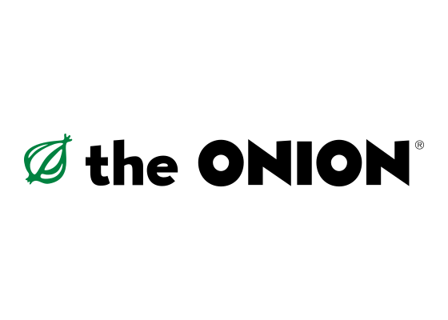
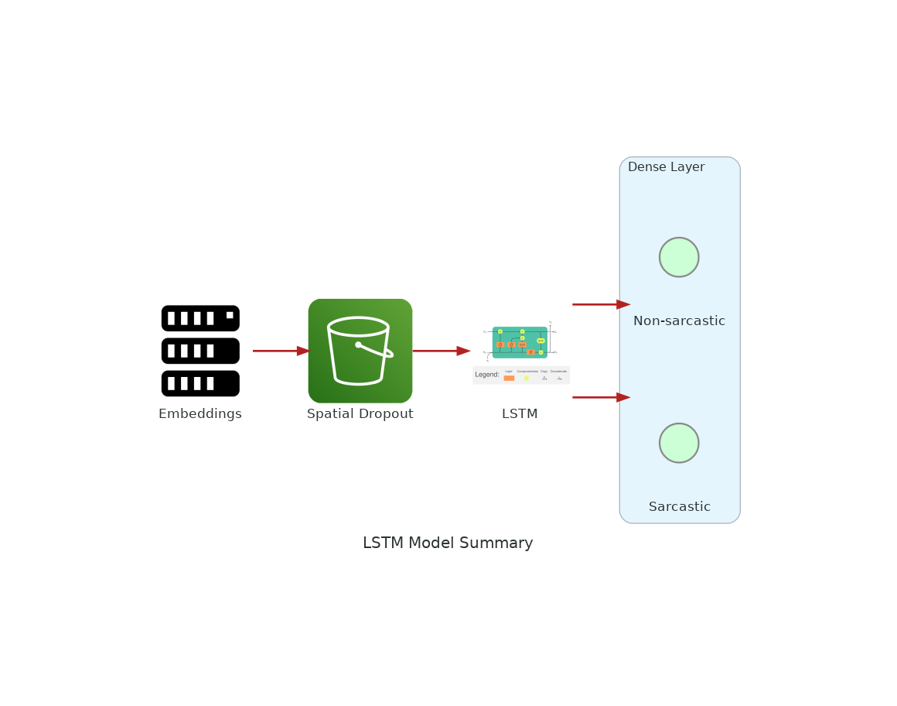

<!-- Improved compatibility of back to top link: See: https://github.com/othneildrew/Best-README-Template/pull/73 -->
<a id="readme-top"></a>
<!--
*** Thanks for checking out the Best-README-Template. If you have a suggestion
*** that would make this better, please fork the repo and create a pull request
*** or simply open an issue with the tag "enhancement".
*** Don't forget to give the project a star!
*** Thanks again! Now go create something AMAZING! :D
-->


<!-- PROJECT SHIELDS -->
<!--
*** I'm using markdown "reference style" links for readability.
*** Reference links are enclosed in brackets [ ] instead of parentheses ( ).
*** See the bottom of this document for the declaration of the reference variables
*** for contributors-url, forks-url, etc. This is an optional, concise syntax you may use.
*** https://www.markdownguide.org/basic-syntax/#reference-style-links
-->
[![Contributors][contributors-shield]][contributors-url]
[![Forks][forks-shield]][forks-url]
[![Stargazers][stars-shield]][stars-url]
[![Issues][issues-shield]][issues-url]
[![LinkedIn][linkedin-shield]][linkedin-url]


<!-- PROJECT LOGO -->
<br />
<div align="center">
  <!-- <a href="https://github.com/othneildrew/Best-README-Template"> -->
    
  <!-- </a> -->

  <h3 align="center">Sarcasm Detector</h3>

  <p align="center">
    An LSTM model built on Keras and trained on the <a href="https://www.kaggle.com/datasets/rmisra/news-headlines-dataset-for-sarcasm-detection"> News Headlines Dataset </a>
    <br />
    <a href="https://github.com/OwaisK4/Sarcasm-Detection-using-LSTM"><strong>Explore the docs »</strong></a>
    <br />
    <br />
  </p>
</div>


<!-- TABLE OF CONTENTS -->
<details>
  <summary>Table of Contents</summary>
  <ol>
    <li>
      <a href="#about-the-project">About The Project</a>
      <ul>
        <li><a href="#built-with">Built With</a></li>
      </ul>
    </li>
    <li>
      <a href="#getting-started">Getting Started</a>
      <ul>
        <li><a href="#prerequisites">Prerequisites</a></li>
        <li><a href="#installation">Installation</a></li>
      </ul>
    </li>
    <li><a href="#usage">Usage</a></li>
    <li><a href="#license">License</a></li>
    <li><a href="#contact">Contact</a></li>
    <li><a href="#acknowledgments">Acknowledgments</a></li>
  </ol>
</details>


<!-- ABOUT THE PROJECT -->
## About The Project

[![Product Name Screen Shot][product-screenshot]](https://example.com)

This project was built for the Deep Learning and Perception course (CS4045), taught in Spring 2025. It consists of an LSTM model trained to identify sarcasm in a headline, and is trained on the <a href="https://www.kaggle.com/datasets/rmisra/news-headlines-dataset-for-sarcasm-detection">News Headlines Dataset For Sarcasm Detection
</a>, by Rishabh Misra.

<p align="right">(<a href="#readme-top">back to top</a>)</p>


### Built With


* [![Python3][Python3]][Python3-url]
* [![Keras][Keras]][Python3-url]
* [![Scikit-learn][Sklearn]][Python3-url]
* [![Tensorflow][Tensorflow]][Python3-url]
* [![Pandas][Pandas]][Python3-url]

<p align="right">(<a href="#readme-top">back to top</a>)</p>


<!-- GETTING STARTED -->
## Getting Started

This is an example of how you may give instructions on setting up your project locally.
To get a local copy up and running follow these simple example steps.

### Prerequisites

* Jupyterlab
  ```sh
  pip install jupyterlab
  ```

### Installation

1. Clone the repo
   ```sh
   git clone https://github.com/OwaisK4/QCNN
   ```
2. Install dependencies
   ```sh
   pip install -r requirements.txt
   ```
3. Change git remote url to avoid accidental pushes to base project
   ```sh
   git remote set-url origin github_username/repo_name
   git remote -v # confirm the changes
   ```
4. Run the notebook using Jupyterlab.
   ```sh
   jupyter-lab Sarcasm_Detection.ipynb
   ```

<p align="right">(<a href="#readme-top">back to top</a>)</p>


<!-- USAGE EXAMPLES -->
## Usage

For generating the diagrams, we used <a href="https://diagrams.mingrammer.com/">Diagrams as Code</a>.
<br>
<br>


_For more examples, please refer to the [Documentation](https://diagrams.mingrammer.com/docs/getting-started/examples)_

<p align="right">(<a href="#readme-top">back to top</a>)</p>


<!-- CONTACT -->
## Contact

Your Name - [@OwaisK484](https://twitter.com/OwaisK484) - owaisalikhan2003@gmail.com

Project Link: [https://github.com/OwaisK4/Sarcasm-Detection-using-LSTM](https://github.com/OwaisK4/Sarcasm-Detection-using-LSTM)

Linkedin: [Owais Ali Khan](https://www.linkedin.com/in/owais-ali-khan-04933b238/)

<p align="right">(<a href="#readme-top">back to top</a>)</p>


<p align="right">(<a href="#readme-top">back to top</a>)</p>


<!-- MARKDOWN LINKS & IMAGES -->
<!-- https://www.markdownguide.org/basic-syntax/#reference-style-links -->
[Python3]: https://img.shields.io/badge/Python-3.11-blue
[Python3-url]: https://jquery.com 
[Keras]: https://img.shields.io/badge/Keras-2.14.0-blue
[Keras-url]: https://jquery.com
[Pandas]: https://img.shields.io/badge/Pandas-2.0.3-blue
[Pandas-url]: https://jquery.com
[Tensorflow]: https://img.shields.io/badge/Tensorflow-2.14.0-blue
[Tensorflow-url]: https://jquery.com 
[Sklearn]: https://img.shields.io/badge/Scikit_learn-1.3.2-blue
[Sklearn-url]: https://jquery.com
[product-screenshot]: assets/LSTM_Cell.svg.png

[contributors-shield]: https://img.shields.io/github/contributors/OwaisK4/Sarcasm-Detection-using-LSTM.svg?style=for-the-badge
[contributors-url]: https://github.com/OwaisK4/Sarcasm-Detection-using-LSTM/graphs/contributors
[forks-shield]: https://img.shields.io/github/forks/OwaisK4/Sarcasm-Detection-using-LSTM.svg?style=for-the-badge
[forks-url]: https://github.com/OwaisK4/Sarcasm-Detection-using-LSTM/network/members
[stars-shield]: https://img.shields.io/github/stars/OwaisK4/Sarcasm-Detection-using-LSTM.svg?style=for-the-badge
[stars-url]: https://github.com/OwaisK4/Sarcasm-Detection-using-LSTM/stargazers
[issues-shield]: https://img.shields.io/github/issues/OwaisK4/Sarcasm-Detection-using-LSTM.svg?style=for-the-badge
[issues-url]: https://github.com/OwaisK4/Sarcasm-Detection-using-LSTM/issues
[linkedin-shield]: https://img.shields.io/badge/-LinkedIn-black.svg?style=for-the-badge&logo=linkedin&colorB=555
[linkedin-url]: https://www.linkedin.com/in/owais-ali-khan-04933b238/